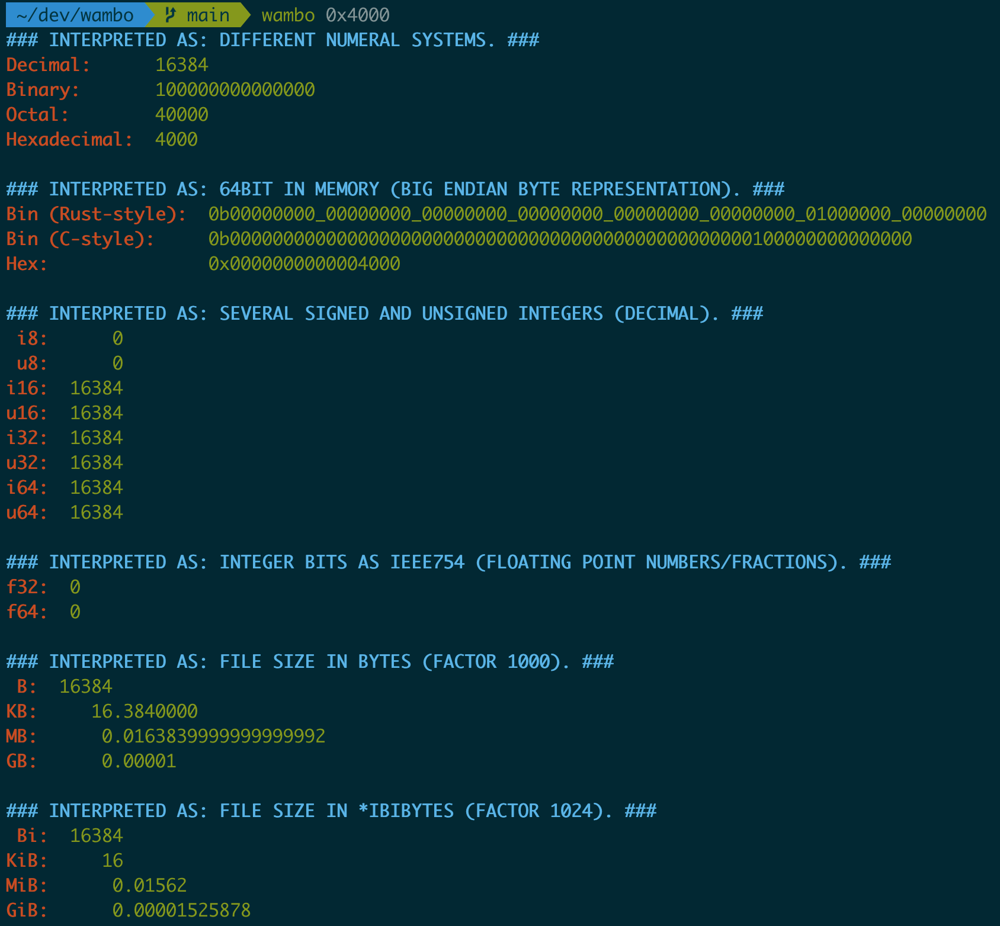

# wambo - All-in-one binary to convert decimal/bin/oct/hex + interpret data as i8-i64, u8-u64, and f32/f64.

**wambo** is a binary that can easily shows you a numeric value in all important
numeral systems (bin, hex, dec) + interprets the input as both signed 
and unsigned values (from i8 to i64, including f32 and f64). It also
easily calculates you mibibytes to bytes, kilobytes to gibibytes and so on.

**Wambo can be found on the web too: [wambo-web.de](wambo-web.de)**

### Usage
**Install:** `$ cargo install wambo`
##### Examples
- `$ wambo 1mb`
- `$ wambo 0xdeadbeef`
- `$ wambo 0b10001111_00000000`
- `$ wambo 0xf_gb` (unorthodox, but possible: 15 gigabyte)
- `$ wambo -h` (for more help and examples)

Just input **a integer number** (maximum 64bit, no decimal/fraction) and **wambo** calculates
all values that are interesting to developers. **Example:** \
"-7" is represented by `0xc0e00000` in floating point standard (IEEE-754). \
So `$ wambo 0xc0e00000` results in the text output listed below.
*(you can find the -7 in the f32 line!)*:

#### Example output (screenshot) for '0x4000'



#### Example output (text) for '0xc0e00000' (-7 in f32)
```
### INTERPRETED AS: DIFFERENT NUMERAL SYSTEMS. ###
Decimal:      5367865903
Binary:       100111111111100110010001000101111
Octal:        47774621057
Hexadecimal:  13ff3222f

### INTERPRETED AS: 64BIT IN MEMORY (BIG ENDIAN BYTE REPRESENTATION). ###
Bin (Rust-style):  0b00000000_00000000_00000000_00000001_00111111_11110011_00100010_00101111
Bin (C-style):     0b0000000000000000000000000000000100111111111100110010001000101111
Hex:               0x000000013ff3222f

### INTERPRETED AS: SEVERAL SIGNED AND UNSIGNED INTEGERS (DECIMAL). ###
 i8:          47
 u8:          47
i16:        8751
u16:        8751
i32:  1072898607
u32:  1072898607
i64:  5367865903
u64:  5367865903

### INTERPRETED AS: INTEGER BITS AS IEEE754 (FLOATING POINT NUMBERS/FRACTIONS). ###
f32:  1.89948070049285888
f64:  0

### INTERPRETED AS: FILE SIZE IN BYTES (FACTOR 1000). ###
 B:  5367865903
KB:     5367865.9029999999329447746
MB:        5367.865902999999889289
GB:           5.3678659030000

### INTERPRETED AS: FILE SIZE IN *IBIBYTES (FACTOR 1024). ###
 iB:  5367865903
KiB:     5242056.5458984375
MiB:        5119.195845603942871093
GiB:           4.9992146929726004

```