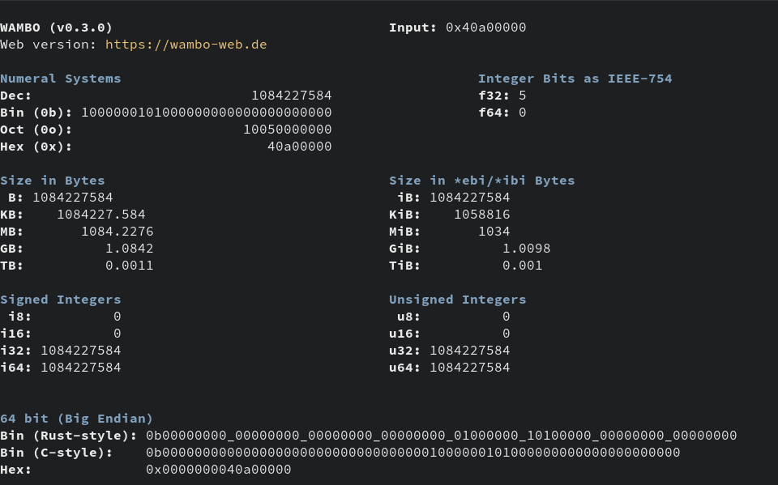

# wambo - All-in-one binary to convert decimal/bin/oct/hex + interpret data as i8-i64, u8-u64, and f32/f64.

**wambo** is a binary that can easily shows you a numeric value in all important
numeral systems (bin, hex, dec) + interprets the input as both signed
and unsigned values (from i8 to i64, including f32 and f64). It also
easily calculates you mibibytes to bytes, kilobytes to gibibytes, and so on.

**Wambo can be found on the web too: [wambo-web.de](https://wambo-web.de)** \
The web version has more functionality and interactivity.

### Usage
**Install:** `$ cargo install wambo`
##### Examples
- `$ wambo 1mb`
- `$ wambo 0xdeadbeef`
- `$ wambo 0b10001111_00000000`
- `$ wambo 0xf_gb` (unorthodox, but possible: 15 gigabyte)
- `$ wambo -h` (for more help and examples)

Just input **an integer number** (maximum 64bit, no decimal/fraction) and **wambo** calculates
all values that are interesting to developers.

**Example:** \
`5` is represented by `0x40a00000` in floating point standard (IEEE-754).
So, `$ wambo 0x40a00000` results in the output in the screenshot below.

#### Example Output (screenshot)

### MSRV
The MSRV is `1.75.0`.
